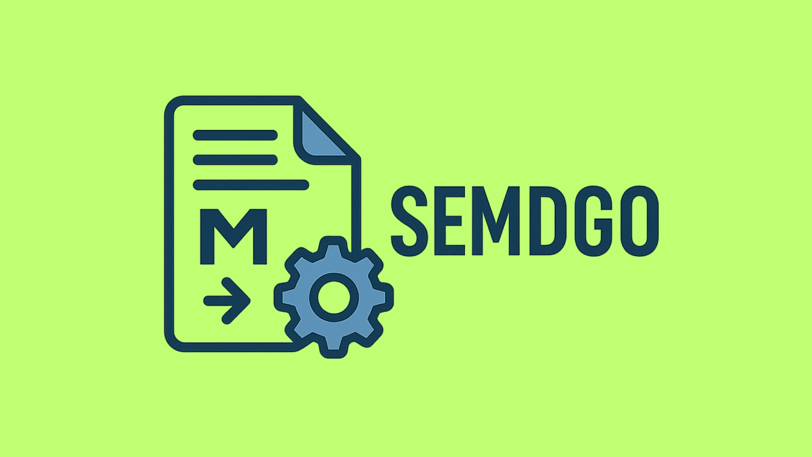

# SEMDGO

SEMDGO (sem-dee-go) is a high-performance markdown file server written in Go. The name stands for "SErve MarkDown with GO". This project provides a lightweight, efficient solution for serving markdown content with minimal configuration.

## Overview

SEMDGO is designed for developers and content creators who need a simple yet powerful way to serve markdown-based documentation, blogs, or any markdown content. It eliminates the need for complex frontend frameworks or HTML templating while maintaining clean, readable content structure.

## Technical Specifications

- **Content Directory**: `/var/semdgo/content/` (configurable via `content_path`)
- **Default Entry Point**: `README.md`
- **Default Port**: 80
- **Architecture Support**: Multi-architecture (amd64, arm64, arm/v7)
- **Runtime**: Containerized (Docker)

## Configuration

SEMDGO can be configured by placing a `semdgo.json` file in the working directory (next to the binary or mounted into the container).

### Custom Content Path

```json
{
  "content_path": "/path/to/your/content"
}
```

The default is `/var/semdgo/content`. The directory must contain a `README.md` as the entry point.

### Custom Port

```json
{
  "port": 8080
}
```

### Automatic HTTPS with Let's Encrypt

SEMDGO supports automatic TLS certificate provisioning via Let's Encrypt — no manual certificate management required. When enabled, HTTP traffic on port 80 is automatically redirected to HTTPS on port 443.

> **Requirements**: your domain must point to the server and ports 80 and 443 must be publicly reachable.

```json
{
  "letsencrypt": {
    "enabled": true,
    "domain": "docs.example.com",
    "email": "you@example.com"
  }
}
```

Certificates are cached at `/var/semdgo/certs` and auto-renewed before expiry.

If no `semdgo.json` is present, SEMDGO defaults to port 80 over plain HTTP.

## Quick Start

### Docker Deployment

1. **Custom Image Build**:
```Dockerfile
FROM shafinhasnat/semdgo
COPY ./content/ /var/semdgo/content/
CMD ["./semdgo"]
```

2. **Docker Compose Deployment**:

Plain HTTP on a custom port:
```yaml
services:
  semdgo:
    image: shafinhasnat/semdgo
    container_name: semdgo
    ports:
      - "8080:8080"
    volumes:
      - ./README.md:/var/semdgo/content/README.md
      - ./semdgo.json:/semdgo.json
```

With Let's Encrypt HTTPS:
```yaml
services:
  semdgo:
    image: shafinhasnat/semdgo
    container_name: semdgo
    ports:
      - "80:80"
      - "443:443"
    volumes:
      - ./README.md:/var/semdgo/content/README.md
      - ./semdgo.json:/semdgo.json
      - semdgo_certs:/var/semdgo/certs

volumes:
  semdgo_certs:
```

Deploy using:
```bash
docker-compose up -d
```

## Running Locally

### Prerequisites

- Go 1.24+
- Git

### Steps

1. **Clone the repository**:
```bash
git clone https://github.com/shafinhasnat/semdgo.git
cd semdgo
```

2. **Install dependencies**:
```bash
go mod download
```

3. **Prepare content**: By default SEMDGO serves files from `/var/semdgo/content/`. You can either create that directory or point to any local path via `semdgo.json`:
```json
{
  "content_path": "/home/you/my-docs",
  "port": 8080
}
```
The directory must contain a `README.md` as the entry point.

4. **Run directly with Go**:
```bash
go run ./cmd/server
```

Or build first, then run:
```bash
go build -o ./dist/semdgo ./cmd/server
./dist/semdgo
```

5. **Open in browser**: Navigate to `http://localhost` (or the port set in `semdgo.json`).

To use a custom port without root privileges, create a `semdgo.json` in the working directory:
```json
{
  "port": 8080
}
```
Then run `./dist/semdgo` and open `http://localhost:8080`.

## Building from Source

### Local Build
```bash
go build -o ./dist/semdgo ./cmd/server
```

### Multi-architecture Docker Build
```bash
docker buildx build \
  --platform linux/amd64,linux/arm64,linux/arm/v7 \
  -t shafinhasnat/semdgo \
  --push .
```